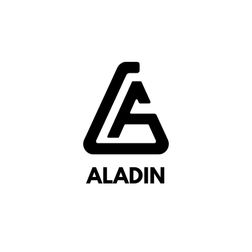

# Aladin - Website Bán Quần Áo Giày Online 

## Mô Tả 

Aladin là một website bán quần áo và giày online. Dự án sử dụng frontend bằng HTML, Bootstrap, JavaScript và CSS, trong khi backend được phát triển bằng PHP. Cơ sở dữ liệu của dự án sử dụng MySQL.

## Cài Đặt 

1. Cài đặt XAMPP và khởi động máy chủ Apache và MySQL.
2. Tải dự án và giải nén vào thư mục `htdocs` trong thư mục cài đặt XAMPP.
3. Tạo cơ sở dữ liệu MySQL và nhập các bảng cần thiết từ tệp SQL (nếu có).
4. Truy cập vào địa chỉ `http://localhost/Aladin` trong trình duyệt để chạy dự án.

## Hướng Dẫn Sử Dụng

1. Đăng nhập hoặc đăng ký tài khoản để bắt đầu mua sắm.
2. Duyệt qua các danh mục sản phẩm và thêm sản phẩm vào giỏ hàng.
3. Hoàn tất thanh toán để đặt hàng.

## Cách Đóng Góp
Nếu bạn muốn đóng góp vào dự án, vui lòng mở issue hoặc pull request. Mọi sự đóng góp đều được hoan nghênh!

## Liên Hệ
Bạn có thể liên hệ với tôi qua các kênh sau:
- **Email**: [nguyennam22279@gmail.com](mailto:nguyennam22279@gmail.com) 
- **GitHub**: [nguyennam1107](https://github.com/nguyennam1107) 

## Biểu Tượng Liên Hệ

